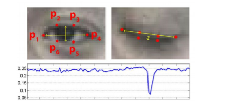

# Drowsiness-Detection-System-Using-OpenCV-and-Machine-Learning
Real-time drowsiness detection system using computer vision techniques that tracks eye aspect ratio (EAR) to identify drowsiness in drivers and triggers an alert. Built using Python, OpenCV, and Dli


## 📌 Overview
This project implements a real-time driver **drowsiness detection system** using **facial landmarks** and **eye aspect ratio (EAR)**. It detects prolonged eye closure and triggers an audible alarm to alert the driver.

---

## 🚗 Use Case

- Detects driver fatigue or drowsiness in real-time
- Helps prevent accidents caused by microsleep during long drives
- Can be integrated with in-vehicle safety systems

---

## ⚙️ Tech Stack

- **Language**: Python
- **Libraries**: OpenCV, Dlib, SciPy, Numpy, SimpleAudio
- **Model**: Dlib's 70-point face landmark model
- **Input**: Webcam feed (real-time)

---

## 🧠 How It Works

1. **Face Detection**: Uses Dlib’s HOG + SVM-based frontal face detector.
2. **Facial Landmarks**: 70-point landmark detection to locate eyes.
3. **Eye Aspect Ratio (EAR)**:
   - Calculates vertical and horizontal eye distances.
   - EAR drops when eyes are closed (shown in graphs/images).
4. **Blink and Drowsiness Detection**:
   - Short closures = Blink.
   - Long closures = Drowsiness.
5. **Alarm Sound**: Plays alarm (`alarm.wav`) when prolonged eye closure is detected.

---

## 📊 Visual Explanation

### 🔘 Eye Aspect Ratio (EAR)


### 👁️ Eye Landmarks


### 🔍 Face Landmarks


---

## 🚀 Installation and Run

### 🔧 Requirements
Install required packages:

```bash
pip install opencv-python dlib numpy scipy simpleaudio
